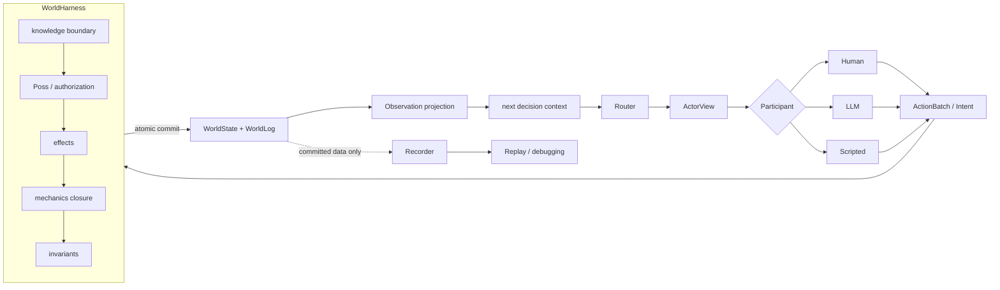

# Token Odyssey — A World Harness for AI Agents

[简体中文](README.zh-CN.md) · [Documentation map](docs/README.md) · [Contributing](CONTRIBUTING.md)

> **Early release:** v0.1's CLI, web UI, default scenario, and technical documentation are currently in Chinese. The project itself is documented here in English for an international audience.

A World Harness is an authoritative runtime for AI agents: it owns world state, validates proposed actions, commits consequences, and controls what each agent may observe.

In Token Odyssey, character-controlling LLMs are agents inside the world—not the simulator of the world.

**One truth. Many perspectives.**<br>
**Agents propose. The world decides.**

## Why a World Harness?

LLM role-playing systems often ask the model to remember the whole world, decide whether its own actions worked, and narrate the consequences. Token Odyssey separates those responsibilities.

| Principle | What it changes |
| --- | --- |
| **World consistency / authority** | One canonical state is the source of truth. An agent proposes a typed `Intent`; the harness checks `Poss`, applies effects and mechanics, validates invariants, and commits or rejects the whole transaction. |
| **Epistemic boundary** | Each character receives only an authorized `Observation` projected from committed events and its own view. No agent receives the canonical `WorldState`. |
| **Agent equality** | Human, LLM, and Scripted controllers act through the same `Participant` contract. A human player has no privileged physics or information channel. |
| **Shared reality / memory provenance** | Agents don't share a story. They share a world. Memories can be traced to a world revision and, for witnessed events, a source event. |
| **Engineering properties** | Runs are replayable and debuggable; context size is controllable; a compatible model can be replaced without rewriting the world. |

“Model-agnostic” here means replaceable among models and services that support the current OpenAI Chat Completions JSON-mode contract. Other protocols require a backend adapter.

Context is an authorized view of world state and observed history—not the world itself.

## The core loop



Recorder and Replay consume committed data; they are not part of the authoritative write path. The design is inspired by Situation Calculus and Fluent Calculus, but does not claim to implement their complete formal semantics.

## See a result in 30 seconds — offline

After installation, run:

```bash
token-odyssey selftest
```

It executes two complete offline paths—Scripted participants and the real LLM translation/session stack backed by deterministic local responses—and then replays both logs. It never reads an API configuration or makes a network request. By default it uses a temporary directory and removes the artifacts; add `--runs-dir runs/selftest` to retain them.

## Demos

All official v0.1 commands must be run from the cloned repository root.

### 1. Scripted single Act — no API key

```bash
token-odyssey run
```

This runs the default [`floodgate_dispatch.yaml`](scenarios/floodgate_dispatch.yaml) Act with three Scripted participants. It writes a replayable record under `runs/` and requires no network access.

### 2. Human + LLM single Act

First create a local API configuration as described below, then run:

```bash
token-odyssey web --run-config configs/llm.local.yaml
```

Open <http://localhost:8000>. In the setup page select Andy as **Human** and Morgan and Clara as **LLM**, then start the Act. No model request is made before you start it.

### Multi-Act Campaign

Single Acts and Campaigns are peer capabilities. A Campaign adds Director, Scene Builder, interlude summary, character-memory, checkpoint, and resume orchestration around the same authoritative Act runtime:

```bash
token-odyssey play --run-config configs/llm.local.yaml
# Later, from an Act boundary:
token-odyssey play --run-config configs/llm.local.yaml \
  --resume runs/campaigns/<campaign-id>
```

The Director and Scene Builder may propose later scenes, but facts inside an Act remain governed by Scenario validation and the World Harness.

## Install from source

Token Odyssey v0.1 is supported from a GitHub clone only. It is not published to PyPI or Conda, does not ship a wheel, and does not yet promise operation outside the source tree.

### `venv` + `pip`

```bash
git clone https://github.com/Sherlock142857/Token-Odyssey.git
cd Token-Odyssey
python3 -m venv .venv
source .venv/bin/activate
python -m pip install -e .
token-odyssey selftest
```

### Conda environment + `pip`

Conda creates the Python environment; it does not install a Token Odyssey Conda package.

```bash
conda create -n token-odyssey python=3.12 -y
conda activate token-odyssey
python -m pip install -e .
token-odyssey selftest
```

For development:

```bash
python -m pip install -e '.[dev]'
ruff check .
ruff format --check .
mypy src
pytest --cov=token_odyssey --cov-report=term-missing
```

Python 3.12, 3.13, and 3.14 are checked in CI.

## Configure an API

Token Odyssey currently uses an OpenAI-compatible Chat Completions backend and requests JSON output. Credentials remain outside Scenario files and are never placed in prompts or run records.

### Generic OpenAI-compatible service

```bash
cp configs/llm.example.yaml configs/llm.local.yaml
export TOKEN_ODYSSEY_API_KEY='replace-with-your-key'
```

Edit the obviously fake endpoint and model IDs in `configs/llm.local.yaml`. The `*.local.yaml` pattern is ignored by Git.

### DeepSeek

The checked example uses DeepSeek's current OpenAI-compatible endpoint, `deepseek-v4-flash` and `deepseek-v4-pro`, with thinking disabled for predictable action JSON. Copy it before making local changes:

```bash
cp configs/llm.deepseek.example.yaml configs/llm.local.yaml
export TOKEN_ODYSSEY_API_KEY='replace-with-your-key'
```

The endpoint and model IDs were checked against the [official DeepSeek API documentation](https://api-docs.deepseek.com/) for this release. Provider APIs and prices can change; verify them before use.

Then test one request or run a bounded live acceptance Act:

```bash
token-odyssey test-connection --run-config configs/llm.local.yaml --profile flash
token-odyssey verify-live --run-config configs/llm.local.yaml \
  --profile flash --rounds 8 --runs-dir runs/live-check
```

`api_key_file` remains supported for a one-line local secret file, but the environment variable is the recommended setup.

> **Cost and privacy warning:** `web` with an LLM config, `run` with an LLM config, `play`, `test-connection`, and `verify-live` can make billable network requests. Model output is non-deterministic. Run records can contain complete prompts and replies, character-private thoughts, observations, and token usage. They must not contain API keys, but they may still contain sensitive story or user data; do not commit `runs/`.

## Kernel at a glance

- `WorldDefinition` says what entities, passages, capabilities, mechanics, and invariants may exist; `WorldState` records the current facts.
- A participant returns an `ActionBatch` of typed `Intent` proposals. An `Action` checks preconditions and describes effects without owning state.
- `WorldHarness` is the single writer. One root action plus its immediate causal mechanics forms one atomic transaction.
- `Fluents` are read-only predicates over a world snapshot, including placement, reachability, control, traversal, and declarative conditions.
- `ObservationSystem` projects committed evidence into per-character `Observation` records and a decision-time `ActorView`.
- `ActRunner` handles turn selection, repair, and submission timing; `Recorder` stores downstream diagnostics and replay inputs.

The spatial model is a placement graph: every non-Room entity has one `inside` or `attached` parent edge terminating at a Room. Installation is a separate relation from placement.

## Compatibility and current limits

The release version and data-format versions are independent:

| Surface | v0.1 commitment |
| --- | --- |
| Release | `0.1.x`; no intentional breaking CLI/schema changes within this line |
| Scenario v3 | Only supported Scenario format |
| RunConfig v3 | Only supported runtime-configuration format |
| Run Log v4 | Only supported run-record format |
| Campaign Checkpoint v1 | Only supported Campaign save format |
| Python imports / localhost HTTP | Internal and unstable |

Unsupported older formats are rejected with a clear error; no migration layer is included.

Known research and engineering gaps:

- **World dynamics:** richer action semantics, concurrent actions, complex space, and multi-layer causal propagation.
- **Emergent narrative:** reducing dependence on a Director so larger arcs emerge from goals, conflict, and world state.
- **Persistent language world:** the runtime currently advances only while a Runner is active. NPCs can act outside the player's view, but the world does not run for days while everyone is offline.
- **Agent continuity:** very long memory, evolving personalities, and less archetypal characters.

The end goal is not an AI game, but a persistent language world.

## Documentation and community

Start with the [documentation map](docs/README.md), then read the [architecture](docs/architecture.md), [kernel algorithm](docs/kernel-algorithm.md), [Scenario v3](docs/scenario.md), [running and replay](docs/running.md), or [Campaign orchestration](docs/campaign.md).

Bug reports and pull requests are welcome; see [CONTRIBUTING.md](CONTRIBUTING.md) and the [Code of Conduct](CODE_OF_CONDUCT.md). Please report vulnerabilities privately as described in [SECURITY.md](SECURITY.md). Changes are recorded in [CHANGELOG.md](CHANGELOG.md).

Token Odyssey is licensed under [AGPL-3.0-only](LICENSE).
