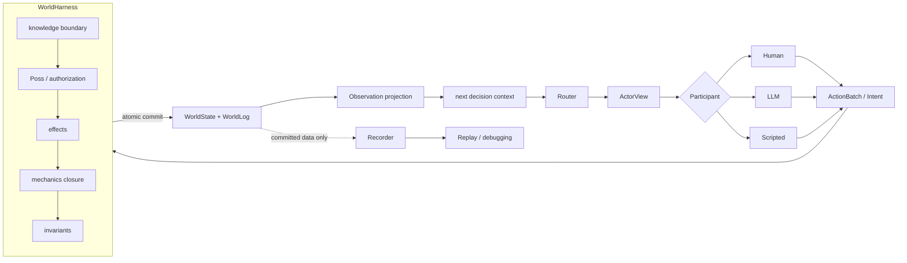

# Token Odyssey — 面向 AI Agent 的 World Harness

[English](README.md) · [文档地图](docs/README.md) · [参与贡献](CONTRIBUTING.md)

> **早期版本：** v0.1 的 CLI、网页、默认场景和技术文档继续使用中文。所有正式命令都从仓库根目录运行。

A World Harness is an authoritative runtime for AI agents: it owns world state, validates proposed actions, commits consequences, and controls what each agent may observe.

World Harness 是 AI Agent 的权威运行层：它拥有世界状态，校验 Agent 提出的动作，提交后果，并控制每个 Agent 能够观察什么。

In Token Odyssey, character-controlling LLMs are agents inside the world—not the simulator of the world.

在 Token Odyssey 中，控制角色的 LLM 是世界里的 Agent，而不是世界本身的模拟器。

**One truth. Many perspectives.**<br>
**Agents propose. The world decides.**

## 为什么需要 World Harness？

常见的 LLM 角色扮演系统会让模型同时记住整个世界、裁定自己的动作是否成功、再叙述后果。Token Odyssey 把这些职责拆开：

| 原则 | 解决的问题 |
| --- | --- |
| **World consistency / authority** | 世界只有一个权威状态源。Agent 只能提出类型化 `Intent`；Harness 校验 `Poss`、应用效果与机关、检查不变量，并原子提交或拒绝整个事务。 |
| **Epistemic boundary** | 每个角色只得到从已提交事件和自身视野投影出的授权 `Observation`，绝不会拿到完整 `WorldState`。 |
| **Agent equality** | Human、LLM、Scripted 都通过同一个 `Participant` 协议行动；人类玩家没有额外的物理权限或信息通道。 |
| **Shared reality / memory provenance** | Agents don't share a story. They share a world. 记忆可以追溯到世界 revision；目击事件还能追溯到来源 event。 |
| **Engineering properties** | 运行可回放、可调试；上下文规模可控；兼容模型可以替换而无需重写世界。 |

这里的 “model-agnostic” 仅指可以替换支持当前 OpenAI Chat Completions JSON-mode 契约的模型或服务；其他协议需要新增 backend adapter。

Context is an authorized view of world state and observed history—not the world itself.

## 核心循环



Recorder 与 Replay 只消费已提交数据，不进入权威写入路径。设计受到 Situation Calculus 与 Fluent Calculus 启发，但不宣称实现了它们完整的形式语义。

## 30 秒离线看到结果

安装后运行：

```bash
token-odyssey selftest
```

它会完整执行两条离线路径：全 Scripted 参与者，以及真实 LLM 翻译器/会话层加确定性本地回复；最后回放两份日志。命令永远不读取 API 配置、不访问网络。默认产物在临时目录中并自动清理；传入 `--runs-dir runs/selftest` 才会保留。

## 两个单 Act Demo 与 Campaign

第一个 Demo 是全脚本单 Act，无需网络和 API key：

```bash
token-odyssey run
```

它运行默认 [`floodgate_dispatch.yaml`](scenarios/floodgate_dispatch.yaml)，并把可回放记录写到 `runs/`。

第二个 Demo 是人类与 LLM 共演的单 Act。先按下文创建本地配置，然后运行：

```bash
token-odyssey web --run-config configs/llm.local.yaml
```

打开 <http://localhost:8000>，在设置页选择 Andy 为 **Human**、Morgan 和 Clara 为 **LLM**，再开始 Act。点击开始前不会调用模型。

单 Act 与多幕 Campaign 是并列核心能力。Campaign 在相同的权威 Act 运行时外增加 Director、Scene Builder、幕间总结、角色记忆、存档与恢复：

```bash
token-odyssey play --run-config configs/llm.local.yaml
token-odyssey play --run-config configs/llm.local.yaml \
  --resume runs/campaigns/<campaign-id>
```

Director 与 Scene Builder 可以创作后续候选场景，但 Act 内事实仍由 Scenario 校验和 World Harness 决定。

## 从源码安装

v0.1 只支持 GitHub clone，不发布 PyPI/Conda 包，不附 wheel，也暂不承诺脱离源码目录运行。

### `venv` + `pip`

```bash
git clone https://github.com/Sherlock142857/Token-Odyssey.git
cd Token-Odyssey
python3 -m venv .venv
source .venv/bin/activate
python -m pip install -e .
token-odyssey selftest
```

### Conda 环境 + `pip`

Conda 只负责创建 Python 环境，不代表存在 Token Odyssey 的 Conda 包：

```bash
conda create -n token-odyssey python=3.12 -y
conda activate token-odyssey
python -m pip install -e .
token-odyssey selftest
```

开发安装与质量门槛：

```bash
python -m pip install -e '.[dev]'
ruff check .
ruff format --check .
mypy src
pytest --cov=token_odyssey --cov-report=term-missing
```

CI 检查 Python 3.12、3.13 和 3.14。

## API 配置

当前 backend 使用 OpenAI-compatible Chat Completions 并请求 JSON 输出。凭据不进入 Scenario、prompt 或运行记录。

通用兼容服务：

```bash
cp configs/llm.example.yaml configs/llm.local.yaml
export TOKEN_ODYSSEY_API_KEY='replace-with-your-key'
```

编辑 `configs/llm.local.yaml` 中显然为假的 endpoint 与 model ID。`*.local.yaml` 已被 Git 忽略。

DeepSeek 示例：

```bash
cp configs/llm.deepseek.example.yaml configs/llm.local.yaml
export TOKEN_ODYSSEY_API_KEY='replace-with-your-key'
```

该示例使用官方当前的 `https://api.deepseek.com`、`deepseek-v4-flash` 和 `deepseek-v4-pro`，并关闭思考模式以稳定生成动作 JSON；发布时已对照 [DeepSeek 官方文档](https://api-docs.deepseek.com/) 核对。服务接口与价格仍可能变化，使用前请再次确认。

验证一次连接或执行受限真实验收：

```bash
token-odyssey test-connection --run-config configs/llm.local.yaml --profile flash
token-odyssey verify-live --run-config configs/llm.local.yaml \
  --profile flash --rounds 8 --runs-dir runs/live-check
```

仍支持指向单行本地密钥文件的 `api_key_file`，但 README 首选环境变量。

> **费用与隐私提醒：** 带 LLM 配置的 `web`、带 LLM 配置的 `run`、`play`、`test-connection` 和 `verify-live` 会或可能发起计费网络请求，模型输出并不确定。运行记录可能包含完整 prompt、回复、角色私有想法、Observation 与 token 用量。记录不应包含 API key，但仍可能包含敏感剧情或用户输入；不要提交 `runs/`。

## 内核概念速览

- `WorldDefinition` 定义可存在的实体、通道、能力、机关和不变量；`WorldState` 保存当前事实。
- Participant 返回类型化 `Intent` 组成的 `ActionBatch`；`Action` 只判断前提并描述效果，不拥有状态。
- `WorldHarness` 是唯一写入者；根动作及其即时机关因果闭包构成一个原子事务。
- `Fluents` 是世界快照上的只读谓词，包括位置、可接触性、控制、通行和声明式条件。
- `ObservationSystem` 把已提交证据投影为逐角色 `Observation` 和决策时 `ActorView`。
- `ActRunner` 负责选角、修正和提交时序；`Recorder` 只记录下游诊断与回放输入。

空间模型是一张 placement 图：每个非 Room 实体都有一条 `inside` 或 `attached` 父边并最终到达 Room；安装关系与 placement 分开记录。

## 兼容边界与当前限制

发行版本与数据格式版本彼此独立：

| 表面 | v0.1 承诺 |
| --- | --- |
| 发行版本 | `0.1.x`；该系列内不主动破坏 CLI/schema |
| Scenario v3 | 唯一支持的场景格式 |
| RunConfig v3 | 唯一支持的运行配置格式 |
| Run Log v4 | 唯一支持的运行记录格式 |
| Campaign Checkpoint v1 | 唯一支持的 Campaign 存档格式 |
| Python 模块路径 / localhost HTTP | 内部实现，暂不稳定 |

旧格式会得到清晰错误并被拒绝，不提供迁移层。

尚未解决的问题：

- **World Dynamics：** 更丰富的 action semantics、并发 action、复杂空间和多层因果传播。
- **Emergent Narrative：** 减少 Director 依赖，让宏观剧情从目标、冲突与世界状态中涌现。
- **Persistent Language World：** 当前只在 Runner 推进时发生行为。NPC 可以在玩家视野外行动，但世界尚不能在所有人离线时持续数天运行。
- **Agent Continuity：** 超长记忆、持续演化的人格和更少脸谱化的角色。

The end goal is not an AI game, but a persistent language world.

## 文档与社区

从[文档地图](docs/README.md)开始，再阅读[总体架构](docs/architecture.md)、[核心算法](docs/kernel-algorithm.md)、[Scenario v3](docs/scenario.md)、[运行与回放](docs/running.md)和[多幕 Campaign](docs/campaign.md)。

欢迎提交 Issue 与 PR；请先阅读 [CONTRIBUTING.md](CONTRIBUTING.md) 和[行为准则](CODE_OF_CONDUCT.md)。安全问题请按 [SECURITY.md](SECURITY.md) 私下报告。版本变化记录在 [CHANGELOG.md](CHANGELOG.md)。

Token Odyssey 使用 [AGPL-3.0-only](LICENSE) 许可。
