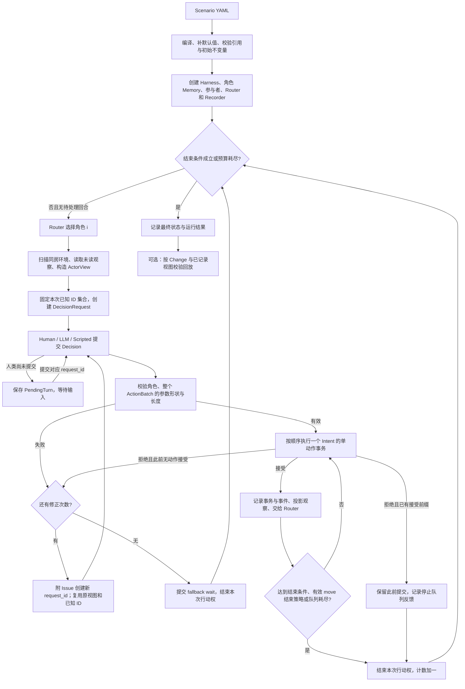
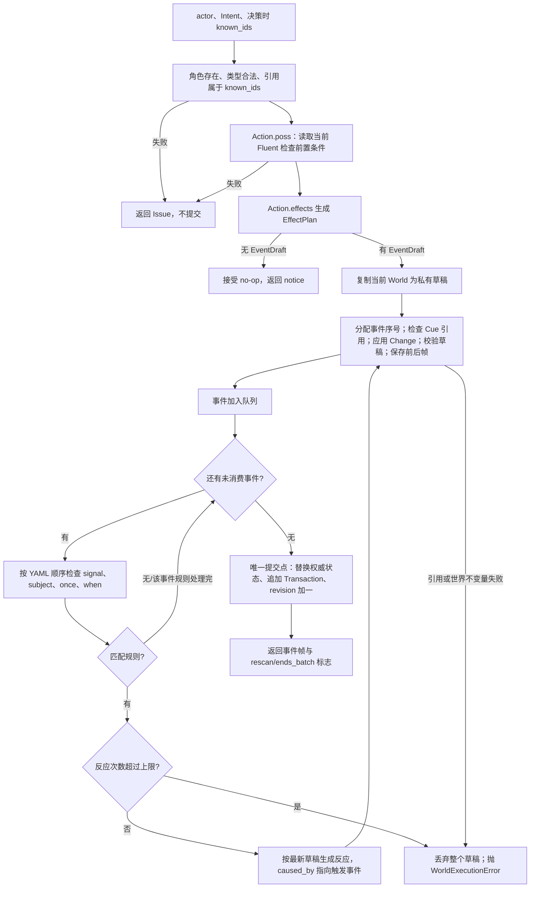
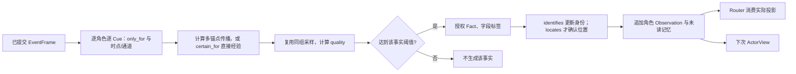

# 核心算法：绘图用说明

本文对应当前实现，推荐画一张运行总图，再展开“事务闭包”“感知投影”“Router”三个子图。图中将权威世界、角色知识、控制器/调度器分为三个泳道；仅 Harness 的提交节点可以替换权威世界。

## 1. 数据与不变量

| 符号/类型 | 内容 | 生命周期 |
|---|---|---|
| D / WorldDefinition | Room、Character、Item、Passage、组合能力、声明式机关 | 本幕固定 |
| S / WorldState | placements、openings、locks、connections、flags、fired_rules、revision | 仅事务提交更新 |
| K_i / Memory | 角色已知身份、最后位置签名、未读 Observation、执行反馈 | 各角色独立 |
| V_i / ActorView | 决策时的当前位置、出口、人物、物品、背包、观察、反馈 | 一次决策快照 |
| I / Intent | kind、amplitude 和动作专用参数 | 不代表动作已发生 |
| Δ / Change | table、key、before、after | 状态更新与回放共用 |
| E / WorldEvent | source、kind、data、signals、subject_ids、changes、cues、caused_by | 提交后的客观记录 |
| T / Transaction | 一个根动作和全部即时反应；前后 revision | 最小提交边界 |

主要不变量：每个非 Room 实体恰有一个 placement，祖先链无环且终止于 Room；inside 的 Item 父节点必须是容器；物品尺寸符合其所在容器/角色的单件限制；开闭、锁态和 flag 表恰好匹配定义；不能既打开又上锁；一个 Slot 至多一个兼容安装件，connections 对应 attached placement。Passage 连接两个不同房间，没有 placement。

`attached` 是空间关系，`installed` 来自 connections；两者不等价。尺寸约束是单件上限，尚未计算总容积、总负重。

## 2. 运行总图



对应 `ActRunner.step / _publish / run`。LLM 的 private_thought 只属于决策记录，不进入 WorldEvent；不同控制器共用相同规则和感知权限。

初始或本次请求的整个 JSON 形状错误，连合法前缀都不会执行。世界条件 Poss 则逐动作检查，前面已提交的状态可影响后面动作。重试仅在本回合还没有动作被接受时发生；被接受的 no-op 也算接受前缀，但不产生事务。默认 max_actions=5、max_retries=2，即最多初次加两次修正。

## 3. 单动作事务与即时反应闭包



这是示意图：同一触发事件的多条规则先按声明顺序处理完，再从队列取下一事件。每条规则的 when 都对**最新草稿**求值，因此前面的规则可以改变后面的匹配结果；不是先一次性预计算全部匹配规则。

精确伪代码：

```text
验证 actor、Intent、known_ids；执行 Poss
plan ← effects(当前世界)
若 plan.event 为空：返回 accepted + notices
W' ← 世界快照；frames ← []
stage(plan.event)
cursor ← 0；reactions ← 0
while cursor < len(frames):
    trigger_event ← frames[cursor].event；cursor += 1
    for rule in 按声明顺序遍历规则:
        if 信号不符/主体不符/once已触发/最新W'不满足when: continue
        reactions += 1
        if reactions > max_reactions_per_action: 丢弃W'并报错
        stage(reaction(W', rule), caused_by=trigger_event.sequence)
提交 W' 与本事务所有事件
```

stage 保存每个事件自己的 before/after；反应上限默认 32。规则 effects 只支持设置 open/locked/flag；发生实际变化时发 state_changed，once 规则还记录 fired_rules。条件为真本身不驱动规则，必须有匹配的显式信号。

事务失败不提交事件，不产生感知，不消耗感知 RNG；更早的事务仍然保留。有效 wait、未触发机关的 operate 仍有事件。重复 open、重复 place、移到当前房间是接受但不写事务。

## 4. 空间查询与感知授权

Fluents 只读。动作前置条件分开询问“认识”“能看见”“可接触”“可通行”。例如透明关闭容器可看见内容物，仍不能伸手取出；其他角色控制的物品需要由其 give，不能靠看见就 take。

空间传播：祖先包含路径上各阻隔系数相乘；跨房时乘房间图上的最大乘积路径，视觉再乘目标房间 light 与物品 visibility。房间图用最大乘积形式的 Dijkstra 搜索，视觉有方向性，声路与通行权限独立。当前规模优先正确性，未做大型场景图缓存。

对某 Cue 的 observer：

```text
若不在 only_for：忽略
若在 certain_for：quality=1，无抽样
否则：
    T ← min(主锚点及所有 requires 的对应时点/通道传播值)
    p ← clamp(T × salience, 0, 1)
    u ← Uniform[0,1)，p=0 时不抽样
    q ← max(0, 1-u/p)，p=0 时 q=0
授权 ← q>0 且 q>=threshold
```

非 guaranteed Cue 的边际授权概率为 `p × (1-threshold)`。因此显著度不是“成功率”，阈值也不是“达到清晰度后必定成功”。同一事件、同一观察者下，共享 anchor/moment/channel/salience/requires 的 Cue 共用一次抽样，使逐层详细披露使用一致证据。



初始 known_entity_ids 只授予身份与静态描述。事件的 Fact、身份辨认 identifies、位置确认 locates 分别授权；父节点未知时不返回其 placement。隔墙声音不暴露声源 ID，目击离开不暴露目的地。

扫描只枚举同房非自身 Item/Character：直接随身物品必定进入背包，其他按视觉传播概率辨认。未重新辨认、但完整祖先位置签名未变且传播仍大于零时，可保留弱持续定位，不刷新未观察到的动态状态。历史记忆不等于当前可见/可触及对象。

## 5. Router 子图


公式、完整动作映射与数值理由见 [Router 说明](router.md)。Router 是运行层策略，不写世界、不新增内核事件、不复制感知算法。三条随机/事实链须在算法图上区分：世界事务确定性，感知 RNG 决定角色得到什么，Router RNG 决定谁获得行动权。

## 6. 回放与本幕边界

回放从 initial_state 出发，依次校验 Change.before 并应用 after，复核事务顺序、世界不变量与 final_state；读取记录过的 Observation 和 ActorView。不会重跑 LLM、Router 或感知随机数。`routing.jsonl` 是选择证据，`perception_samples.jsonl` 是感知证据，均属于作者调试材料。

目前对象集合固定、机关即时执行；没有实体生成/销毁、战斗伤害、延迟计时器、异步世界写入或自动跨幕继承。磁盘日志是提交后输出，不是数据库级崩溃原子性保证。

跨幕构建 AI 应生成新的可编译 Scenario；哪些实体、事实、私有记忆需要继承应由幕间协调器明确提供。不要在图中画出尚未实现的“LLM直接修改世界”或“自然语言自动成为事实”通路。生成规范见 [场景构建约定](scenario-generation.md)。
